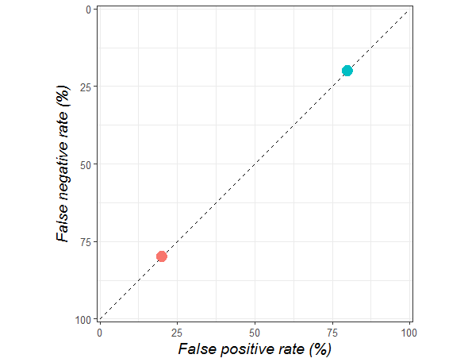

---
jupyter:
  jupytext:
    text_representation:
      extension: .Rmd
      format_name: rmarkdown
      format_version: '1.1'
      jupytext_version: 1.1.3
  kernelspec:
    display_name: Python 3
    language: python
    name: python3
---

# Métricas de avaliação dos modelos


- Vermelho (inferior esquerdo) = métricas invariantes de prevalência. 
- Azul (superior direito) = métricas variantes à prevalência. 
- Roxo (inferior direito) = métricas compostas.


## 1. Introdução

O objetivo desta prática é analisar, na prática, as medidas de avaliação para os modelos de classificação mencionados.

Para isso, vamos trabalhar tentando prever a probabilidade de um funcionário deixar a empresa. Um conjunto de dados está disponível para isso 

Os campos incluídos são:

1. Última avaliação
2. Quantidade de projetos nos quais trabalhou
3. Média de horas mensais trabalhadas
4. Tempo na empresa
5. Sofreu algum acidente de trabalho
6. Recebeu uma promoção no último ano
7. Nível salarial

O objetivo, portanto, é prever a probabilidade de $P(left=1 | X)$ 


## 2. Métricas de avaliação para problemas de classificação

Como de costume, importar os dados e o conjunto de dados

```{python}
from sklearn import preprocessing
from sklearn.model_selection import train_test_split
from sklearn.datasets import make_classification
from sklearn.linear_model import LogisticRegression
import matplotlib.pyplot as plt
import pandas as pd
import numpy as np
```

```{python}
df = pd.read_csv('HR_comma_sep.csv')
df.sample(10)
```

Criamos a matriz de preditores ($X$) e o target ($y$)

```{python}
train_cols = ['satisfaction_level', 'last_evaluation', 'number_project', 'average_montly_hours', 
'time_spend_company', 'Work_accident', 'promotion_last_5years']
X = df[train_cols]
y = df['left']
```

Fazer o split entre train e test:

```{python}
X_train, X_test, y_train, y_test = train_test_split(X, y, test_size=0.33, random_state=42)
```

### 2.1 Treinando um primeiro classificador

Como primeira etapa (e para manter o problema simples), começamos treinando uma regressão logística.

```{python}
clf = LogisticRegression(C=1e10)
clf.fit(X_train, y_train)
```

```{python}
y_pred = clf.predict(X_test)
```

### 2.2 Métricas: Accuracy

Como você deve lembrar, a precisão é calculada como a proporção de amostras corretamente classificadas no total de amostras.

```{python}
from sklearn.metrics import accuracy_score
print('Accuracy=', accuracy_score(y_test, y_pred))
```

Ou seja, neste caso, constatamos que 76% dos casos - no conjunto de teste - foram classificados corretamente.

Agora, quão bom é este classificador? O que significa o fato de podermos classificar corretamente essa proporção de casos?

Uma primeira maneira de começar a responder a essa questão é comparar o desempenho com um classificador muito simples e (quase) trivial: ele é geralmente chamado de "classificador nulo" e consiste simplesmente em prever levando em conta apenas a classe mais frequente.

```{python}
y_test.value_counts()
```

```{python}
y_test.mean()
```

Ou seja, 23% dos casos no conjunto de treino são 1, ou seja, deixarão a empresa. Portanto, a proporção de 0 (ou seja, casos que não deixarão a empresa) será:

```{python}
1.0 - y_test.mean()
```

Nosso modelo simples, então, sempre faria previsões iguais a zero. Se fizéssemos as previsões em função desses dados, qual exatidão obteríamos? Na verdade, poderíamos esperar obter uma precisão próxima a 76%. Ou seja, esperaríamos estarmos corretos (sem nenhuma outra informação) em 76% dos casos.

Desta forma, pareceria que o modelo de regressão logística não é tão bom: não parece melhorar muito em comparação com o modelo simples. Se considerássemos somente a precisão, poderíamos ter cometido um erro na avaliação do nosso modelo. Por isso, considerar outras métricas de avaliação costuma ser útil. 


### 2.3 Métricas: Matriz de confusão

Embora tenhamos trabalhado com essa entrada, até agora estamos fazendo isso intuitivamente. Tentaremos entender melhor o que é uma matriz de confusão.

Basicamente, é uma tabela de contingência que tabula a distribuição dos casos analisados de acordo com seu valor real ("observado") e seu valor estimado pelo modelo ("previsto"). 

Em `confusion_matrix` é importante lembrar que o primeiro argumento corresponde aos valores observados e o segundo, aos valores previstos:

```{python}
from sklearn.metrics import confusion_matrix
confusion = confusion_matrix(y_test, y_pred)
print(confusion)
```

Os dados observados estão representados nas linhas (`y_test`). Os dados previstos pelo modelo estão representados nas colunas (`y_pred`).

** Matriz de confusão **

| | Pred Stay ($y\_pred=0$)| Pred Left ($y\_pred=1$)| Total|
| :-------------------- |:----------------------:| :---------------------:|-----:|
| Obs Stay ($y\_test=0$) | 3465 | 304 |3769 |
| Obs Left ($y\_test=1$) | 898 | 283 |1181 | 
| Total | 4363 | 587 |N=4950|
     
Agora, cada caixa fornece informações sobre o desempenho do classificador:

<!-- #region -->
* **True Positives (TP):** previmos corretamente que o funcionário deixará a empresa (295)
* **True Negatives (TN):** previmos corretamente que o funcionário permanecerá na empresa (3497)
* **False Positives (FP): ** previmos que o funcionário deixaria a empresa, mas ele permaneceu (265)
* **False Negatives (FN): ** previmos que o funcionário permaneceria, mas ele deixou a empresa (893)


Para realizar alguns cálculos, vamos atribuir esses casos a variáveis:
<!-- #endregion -->

```{python}
TP = confusion[1, 1]
TN = confusion[0, 0]
FP = confusion[0, 1]
FN = confusion[1, 0]
```

### 2.4 Métricas computadas a partir da matriz de confusão: Accuracy

```{python}
print((TP + TN) / float(TP + TN + FP + FN))
print(accuracy_score(y_test, y_pred))
```

### 2.5 Métricas computadas a partir da matriz de confusão: Classification Error

Basicamente, é o complemento de accuracy. Quantifica o erro total cometido pelo classificador:

```{python}
class_error = (FP + FN) / float(TP + TN + FP + FN)

print(class_error)
print(1 - accuracy_score(y_test, y_pred))
```

### 2.6 Métricas computadas a partir da matriz de confusão: Sensitivity (ou recall)

Mede a capacidade (quão “sensível”) do modelo de detectar os verdadeiros positivos (TP) em todos os casos que são positivos (FN + TP). Em nosso exemplo, do total de pessoas que deixarão a empresa, quantas o modelo consegue classificar corretamente?

```{python}
from sklearn.metrics import recall_score
sensitivity = TP / float(FN + TP)

print(sensitivity)
print(recall_score(y_test, y_pred))
```

### 2.7 Métricas computadas a partir da matriz de confusão: Specificity

Mede a capacidade de detectar os verdadeiros negativos” (TN) no total de casos que são negativos (TN + FP). Quão específico ou seletivo é o modelo ao prever as instâncias positivas?

```{python}
specificity = TN / (TN + FP)

print(specificity)
```

Nosso modelo parece ser muito específico e pouco sensitivo.


### 2.8 Métricas computadas a partir da matriz de confusão: Precision

Mede o quão “preciso” é o classificador ao prever as instâncias positivas. Ou seja, quando o classificador prevê um valor positivo, com qual frequência essa previsão está correta?

```{python}
from sklearn.metrics import precision_score

precision = TP / float(TP + FP)

print(precision)
print(precision_score(y_test, y_pred))
```

### 2.9 Métricas computadas a partir da matriz de confusão: F1-Score

É uma média harmônica entre precision e recall.

```{python}
from sklearn.metrics import f1_score

f1 = 2*((precision*sensitivity)/(precision+sensitivity))

print(f1)
print(f1_score(y_test,y_pred))
```

### 3. Conclusões

<!-- #region -->
A matriz de confusão fornece um panorama mais completo do desempenho do classificador. 

Em quais métricas deveria se concentrar? Obviamente, depende do problema, do objetivo.

* **Exemplo - filtro de SPAM:** Parece que os FN são mais aceitáveis (spam entra na caixa) do que os FP (e-mail útil é filtrado como SPAM).


* **Exemplo - detector de fraudes:** neste caso, parece preferível tolerar FP (transações que NÃO são falsas classificadas como falsas) do que deixar passar TP (transações fraudulentas que não são detectadas). Seria preferível minimizar sensitivity.
<!-- #endregion -->

## 5. Bônus: fazendo validação cruzada com outras métricas

Suponha que queremos estimar o erro de generalização do nosso modelo de regressão, mas usando validação cruzada. A função `cross_val_score` pode ser usada trocando a métrica a ser avaliada:

```{python}
from sklearn.model_selection import StratifiedKFold, cross_val_score

kf = StratifiedKFold(n_splits=10, shuffle = True)

print('F1-CV=', np.mean(cross_val_score(clf, X, y, cv=kf, scoring='f1')))
print('Recall-CV=', np.mean(cross_val_score(clf, X, y, cv=kf, scoring='recall')))
print('Specificity-CV=', np.mean(cross_val_score(clf, X, y, cv=kf, scoring='precision')))
```

# Escolhendo entre duas métricas, um exemplo da area da saúde:

A sensibilidade de um método reflete o quanto este é eficaz em identificar corretamente, dentre todos os indivíduos avaliados, aqueles que realmente apresentam a característica de interesse. Assim, no caso do IMC, a sensibilidade mede o quanto o método é capaz de identificar aqueles que de fato apresentam obesidade.

Já a especificidade de um método reflete o quanto ele é eficaz em identificar corretamente os indivíduos que não apresentam a condição de interesse (no exemplo dado, seriam os indivíduos que não são de fato obesos). 

Assim, métodos de diagnóstico de excesso de peso que apresentam baixa sensibilidade são aqueles mais propensos a fornecer resultados chamados de falso-negativos (quando se deixa de detectar crianças que são realmente obesas) e métodos que apresentam baixa especificidade são mais propensos a dar resultados falso-positivos (detectando como obesas crianças que não apresentam obesidade). 

A escolha entre uma maior ou menor sensibilidade do método diagnóstico, e sua relação inversa com a especificidade, depende da aplicação a ser dada. Do ponto de vista de saúde pública, é especialmente importante que o método diagnóstico da obesidade infantil tenha boa sensibilidade, a fim de identificar o maior número possível (de preferência 100%) das crianças que apresentam obesidade. 

Nessa situação, é menos grave classificar algumas crianças que não são obesas como apresentando obesidade (as quais não seriam prejudicadas por intervenções de educação nutricional, por exemplo) do que deixar de detectar crianças que são realmente obesas, pois estas, ficando sem tratamento, apresentam um maior risco de desenvolver doenças na infância e permanecer obesas na vida adulta, com grandes prejuízos à saúde.


# Avançado - Curva ROC

<!-- #region -->
O termo espaço de característica de operação do receptor (ROC)  é um bocado, e proferir a frase é um modo seguro de gerar olhos vidrados entre o pessoal não estatístico. Mas acontece que é realmente muito simples.

Toda decisão que tomamos é um compromisso. Nós não sabemos a escolha “certa”, então temos que minimizar nossa chance de estar errado. Mas as escolhas têm duas maneiras de estar errado:

    1) você decide fazer algo quando não deveria
    2) você decide não fazer algo quando deveria ter
Estes são os dois elementos do espaço do ROC.

Vamos usar um exemplo cotidiano: você está tentando escolher um lugar para comer. Se você só vai a lugares que você apreciou no passado, você não terá muitas refeições ruins, mas você também não vai experimentar alguns lugares legais. Se você escolher aleatoriamente para onde ir, você pode ter muitas refeições terríveis, mas também encontrará algumas pedras preciosas que de outra forma você perderia.

O primeiro método tem uma alta taxa de falsos negativos , o que significa que você descarta muitos lugares que você poderia ter gostado. Ele também tem uma taxa de falsos positivos muito baixa , porque você raramente irá para um lugar que você não gosta.

O segundo método é o inverso, com baixa taxa de falsos negativos e alta taxa de falsos positivos. Cada pessoa tem um saldo diferente dessas duas taxas; Alguns preferem tentar coisas novas, outros preferem ficar com o que sabem, outros estão no meio.

Se esses termos forem novos para você, tire um segundo para considerá-los, porque eles são fundamentais para os testes de desempenho. Para reafirmar as definições, um falso negativo significa que você chamou algo negativo (não vá), mas na realidade era positivo (deveria ter sido, você teria gostado). Um falso positivo é o oposto; você chamou isso de positivo (então você tentou), mas você não deveria ter (porque você não gostou).

O importante aqui é que, para qualquer processo decisório, esses erros se equilibram. Se os falsos positivos aumentarem, os falsos negativos vão diminuir e vice-versa.

O espaço ROC é uma maneira de definir visualmente esse trade-off.



O ponto laranja mostra uma pessoa que só vai para os mesmos lugares (eles têm refeições ruins 20% do tempo, mas perdem 80% dos bons restaurantes). O ponto azul é alguém que tenta coisas novas (eles têm refeições ruins 80% do tempo, mas só perdem 20% de boas experiências de comida).

Até aí tudo bem, espero. Mas o espaço do ROC é muito mais interessante do que isso, porque também pode nos mostrar como  uma decisão é boa . A chance de você estar feliz com uma decisão de comida não é apenas decidida pela forma como você troca os dois tipos de erro, mas também pela precisão com que você consegue identificar um bom lugar para comer.

Você pode fazer muito melhor do que chance ao escolher um lugar para comer. Você poderia perguntar a seus amigos, escolher um lugar que serve uma cozinha que você geralmente gosta, olhar para comentários e assim por diante.

Quando você começa a tomar  decisões melhores , sua posição no espaço do ROC se moverá para cima e para a esquerda. E isso tem a interessante propriedade de fazer o trade-off entre falsos positivos e falsos negativos  formar uma curva . Essa curva é, de forma pouco surpreendente, chamada de curva ROC e é igualmente significativa para conjuntos de tomadores de decisão (por exemplo, uma série de especialistas) ou tomadores de decisão individuais (como uma pessoa que está variando conscientemente suas taxas de falso negativo e falso positivo) .

O ponto que você escolhe para balancear falsos positivos e falsos negativos é chamado de  ponto de operação , que é parte de onde a curva característica de operação  do receptor recebe seu nome. Outro nome para isso é o  limite , que pode ser mais intuitivo. Alguém que minimiza quantas refeições ruins come só vai confiar em restaurantes de que já gosta; eles têm um limite alto para tomar uma decisão. Uma pessoa com um limiar baixo  está disposta a tentar qualquer coisa, eles não têm filtro.


A área cinza nos diz como um tomador de decisão é bom, independente de como eles equilibram falsos positivos e falsos negativos. Quanto mais cinza, melhores as decisões.

Uma vez que quanto mais à esquerda, melhor suas decisões são, a  área sob a curva ROC , também conhecida como ROC AUC ou AUROC, é uma ótima métrica para entender como suas decisões são boas.

**Resumo**

- Todas as decisões compensam o risco de falsos positivos e falsos negativos.
- Espaço ROC é como visualizamos esse trade-off.
- Tomadores de decisão (isto é, pessoas, sistemas de inteligência artificial) vivem em um certo ponto no espaço do ROC, embora possam se movimentar no espaço alterando seu limite.
- Melhores tomadores de decisão estão à frente e à esquerda no espaço do ROC.
- Múltiplos tomadores de decisão da mesma habilidade ou perícia tendem a viver em uma curva no espaço ROC, que chamamos de curva ROC. Isso se aplica a grupos de tomadores de decisão e a um único tomador de decisões em diferentes limites.
- A área sob a curva ROC é uma medida geral de quão bom é um sistema em tomar decisões independentes do limiar de decisão. Isso pode ser visto como uma medida de especialização.
- Tomadores de decisão abaixo da curva são sub-ótimos.


Para ir além, veja: https://lukeoakdenrayner.wordpress.com/2018/01/07/the-philosophical-argument-for-using-roc-curves/


**Propriedades**

Invariância de prevalência
A prevalência é a proporção de exemplos positivos para negativos nos dados. Para remover a prevalência da consideração, simplesmente não precisamos comparar esses dois grupos; precisamos olhar para os aspectos positivos e negativos separadamente uns dos outros.

A curva ROC obtém isso plotando a sensibilidade no eixo Y e a especificidade no eixo X.

Sensibilidade é a razão entre verdadeiros positivos (casos positivos corretamente identificados como positivos pelo tomador de decisão) e o número total de casos positivos nos dados. Então você pode ver, só olha para positivos.

A especificidade  tem a mesma propriedade, sendo a razão entre os negativos reais e o número total de negativos. Apenas os negativos são importantes.


**Como interpretar a AUC**

O número reflete a probabilidade de classificar corretamente (colocando em ordem) qualquer par de exemplos negativos / positivos aleatórios. 

(Não vamos aprofundar nesse tema mas há uma importância matemática por estar profundamente ligada à estatística U de Mann-Whitney. https://www.alexejgossmann.com/auc/ )


Se você quiser poucos falsos positivos, por exemplo para um algoritmo que sugere um tratamento muito caro para uma doença simples, você deve ir com a curva A, ela é muito ingreme no canto inferior esquerdo que significa que você conseguirá uma sensibilidade decente enquanto mantém a FPR muito baixo.

Já a curva B é boa para o caso contrario, pois você terá uma sensibilidade muito alta para especificidades moderadas. Você deverá escolher a curva B quando o custo de não capturar um caso positivo (como no exemplo da doença) for muito alto em relação ao custo de errar a afirmação (no nosso exemplo isso significa uma doença altamente mortifera, que o fato de falarmos que o sujeito não há tem causará um grande custo).


** Outra forma de interpretar a AUROC**


(inspirado por essa analise de autismo: https://www.spectrumnews.org/opinion/viewpoint/quest-autism-biomarkers-faces-steep-statistical-challenges/ )


O grafico abaixo é exatamente a mesma coisa que a nossa matriz de confusão plotados como distribuições de probabilidade - os números de verdadeiros positivos, verdadeiros negativos, falsos positivos e falsos negativos. Assim, podemos ver que, com esse limite, haverá mais falsos negativos e menos falsos positivos.


Nesse caso, o limite já foi selecionado (linha azul na figura é a fronteira de decisão) e podemos ver isso refletido como o círculo aberto na curva ROC. Mas queremos usar nossa curva ROC para selecionar um limite. O que acontece quando nós variamos o limite?


Vamos variando o limiar/threshold/fronteira de decisão que separa os targets 0/1, isso move a posição ao longo da curva ROC, mas a curva permanece inalterada. Isso faz sentido, o limiar muda a razão de negativos reais para negativos de condição e positivos verdadeiros para positivos de condição, mas isso não muda a experiência do tomador de decisão.

Mas isso levanta a questão - qual é a expertise? (Nesse caso do médico diagnosticando autismo ou do nosso modelo competindo com o médico)


A perícia é quão bem o tomador de decisão pode separar as classes. Quanto menos se sobrepõem, menos erros e mais a curva ROC se move para cima e para a esquerda.

E isso faz sentido no cenário da aprendizagem profunda também. Quando otimizamos a perda de registros, estamos tentando empurrar as classes o mais longe possível. Assim, podemos ver a comparação direta aqui: quanto melhor separarmos nossas classes (quanto mais treinado for o nosso modelo), maior será a AUC, não relacionada ao limiar ou à prevalência. É por isso que penso que a perícia é proporcional ao AUC ^^.

A outra coisa que isso mostra muito bem é que, embora o número de erros mude com especialização, o número de casos de condição positiva e de condição negativa não. A prevalência é inalterada.

Então, precisamos visualizar o elemento final: o que acontece com as funções de densidade de probabilidade e a curva ROC conforme as mudanças de prevalência? Sabendo o que fazemos do resto do post, esperamos que o tamanho proporcional dos picos mude, mas não as razões que compõem a curva ROC. Acontece que isso é certo.


A curva ROC permanece a mesma porque a razão para positivos verdadeiros para positivos de condição permanece a mesma (assim como TN: CN). Mas a proporção de verdadeiros positivos para  falsos positivos muda drasticamente. A barra de duas cores na parte inferior reflete a precisão e vai de acima de 80% a menos de 10% à medida que a prevalência muda.

Na pagina original há um grafico interativo: https://www.spectrumnews.org/opinion/viewpoint/quest-autism-biomarkers-faces-steep-statistical-challenges/
<!-- #endregion -->

```{python}

```
